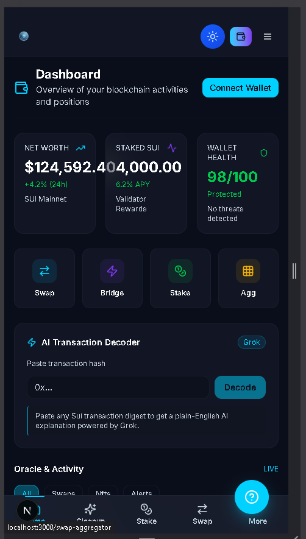
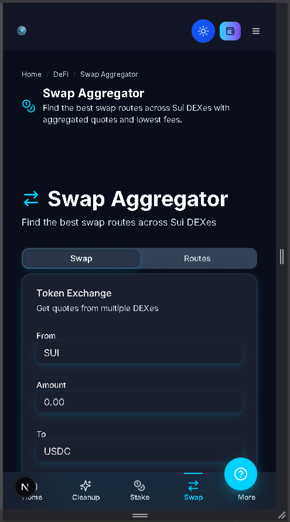
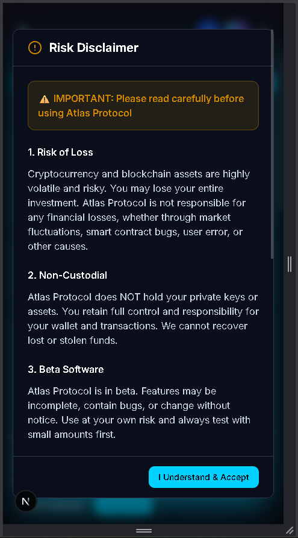
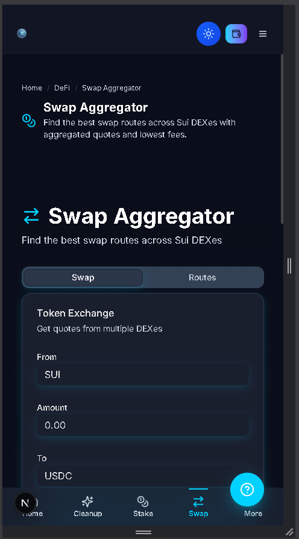
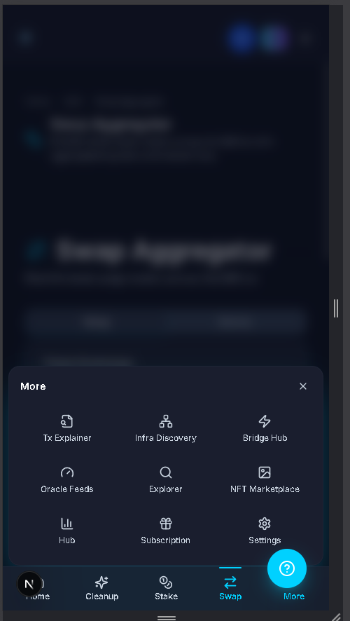
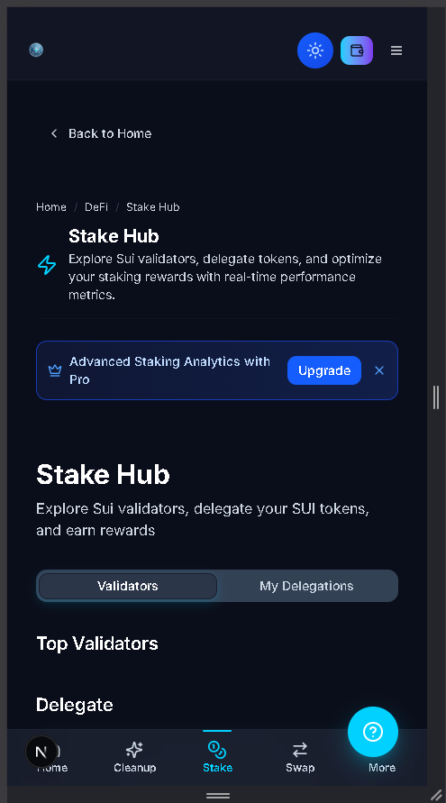

<div align="center">

# Sui DeFi dApp

**A DeFi dApp on Sui - swap, provide liquidity, and stake**

[](https://sui.io)
[](https://nextjs.org)
[](https://www.typescriptlang.org)
[]()

*The on-chain side of Atlas: connect a Sui wallet, swap tokens, and put assets to work.*

</div>

> **Related:** ecosystem website -> [atlas-sui-ecosystem-website](https://github.com/plinkdev1/atlas-sui-ecosystem-website)

---

## What Is This?

Atlas DeFi is the decentralized application of the Atlas ecosystem on Sui. Users connect a Sui wallet and interact with core DeFi primitives - swaps, liquidity, and staking - through a clean, responsive interface.

---

## Features

| Feature | Description | Status |
|---|---|:---:|
| Sui wallet connect | Connect via Sui dApp Kit | ✅ |
| Token swap | Swap interface with quotes | ✅ |
| Portfolio view | Balances and positions | 🚧 |
| Liquidity pools | Provide and manage liquidity | 🚧 |
| Staking | Stake assets for yield | 🚧 |

---

## How It Works

```
Client (Next.js)
     │  Sui dApp Kit
     ▼
Sui wallet ──▶ Move contracts (swap · pools · staking)
```

---

## Tech Stack

| Layer | Technology |
|-------|------------|
| Frontend | Next.js, React, TypeScript |
| Styling | Tailwind CSS, shadcn/ui |
| Chain | Sui - Move contracts |
| Wallet | Sui dApp Kit (@mysten/dapp-kit) |

---

## Project Structure

```
atlas-sui-defi-dapp/
.vscode/
   settings.json
app/
   about/
   admin/
   api/
   auth/
   bridge-hub/
   cetus-test/
components/
   homepage/
   ui/
   widgets/
   ad-carousel.tsx
   ad-management-modal.tsx
   admin-dashboard-content.tsx
contracts/
   sources/
   deployed_addresses.json
   Move.toml
hooks/
   use-airpoints-earn.ts
   use-airpoints-sync.tsx
   use-airpoints.ts
   use-analytics.ts
   use-mobile.ts
   use-pro-status.ts
lib/
   supabase/
   admin-auth.ts
   admin-check.ts
   ads-data.ts
   ai-explain-utils.ts
   api-key-utils.ts
public/
   images/
   logos/
   3d-coin-atlas.png
   atlas-logo.png
   footer-effect.png
   icon.svg
scripts/
   001_create_wallet_users_schema.sql
   002_create_user_profiles_table.sql
   003_create_user_data_table.sql
   004_create_providers_table.sql
   005_add_admin_moderation.sql
   006_create_entitlements_table.sql
styles/
   globals.css
types/
   advertising.ts
   chain-id.ts
utils/
   api/
.gitignore
components.json
CONTRIBUTING.md
next.config.mjs
next-env.d.ts
package.json
package-lock.json
pnpm-lock.yaml
postcss.config.mjs
proxy.ts
README.md
SECURITY.md
tsconfig.json
```

---

## Screenshots

<table>
<tr><td width="50%"></td><td width="50%"></td></tr>
<tr><td width="50%"></td><td width="50%"></td></tr>
<tr><td width="50%"></td><td width="50%"></td></tr>
</table>

---

## Getting Started

```bash
npm install --legacy-peer-deps --ignore-scripts
npx next dev
```

---

## Notes

Shared as a portfolio artifact demonstrating product and system design. Early prototype, not a finished product; not financial advice.

<div align="center">

Built on Sui · MIT

</div>
